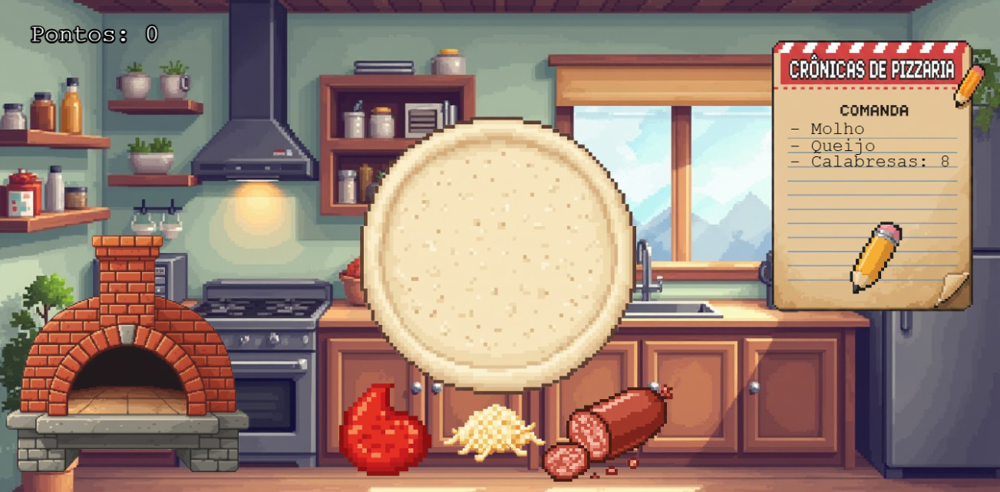
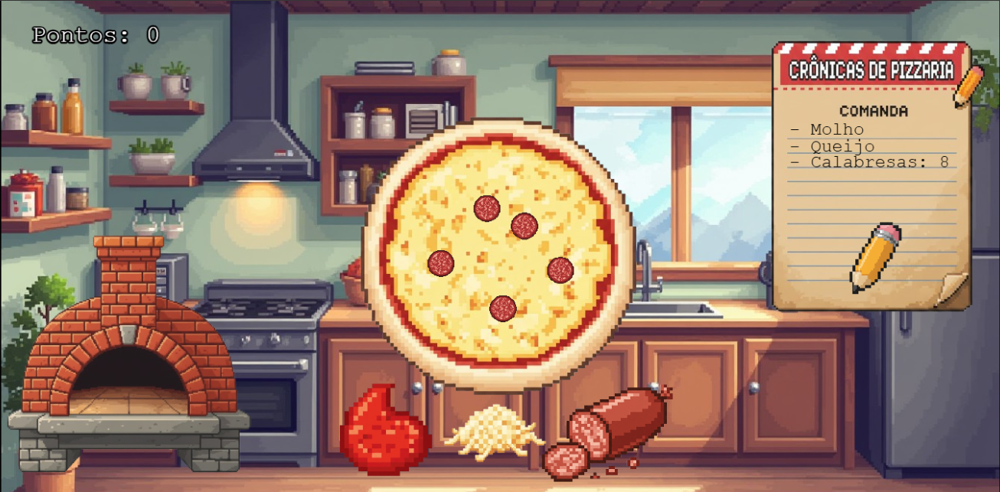

# 🍕 Crônicas de Pizzaria  

Um jogo divertido feito em **Phaser 3**, onde você administra sua pizzaria e deve montar as pizzas conforme os pedidos dos clientes.  

👉 **Jogue agora no navegador:**  
🔗 [Crônicas de Pizzaria](https://akirasantiago0206.github.io/jogo-cronicas-pizzaria/)  

---

## 🎮 Como Jogar  
1. Veja o **pedido do cliente** na comanda (lado direito da tela).  
2. Arraste os ingredientes certos para a pizza.  
3. Coloque no forno para assar.  
4. Entregue e ganhe pontos conforme acerta os pedidos!  

---

## 🖼️ Screenshots  

### Tela principal  
  

### Montagem da pizza  
  

### Pizza no forno  
  

---

## 🚀 Tecnologias  
- [Phaser 3](https://phaser.io/) (engine de jogos em JavaScript)  
- JavaScript  
- HTML5 & CSS3  

---

## ⚙️ Como rodar localmente  
1. Clone este repositório:  
   ```bash
   git clone https://github.com/akirasantiago0206/jogo-cronicas-pizzaria.git
